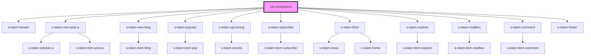

# my-component

<!-- Auto Generated Below -->

## Dependencies

### Depends on

- [s-islam-header](../s-islam-header)
- [s-islam-new-post-a](../s-islam-new-post-a)
- [s-islam-new-blog](../s-islam-new-blog)
- [s-islam-popular](../s-islam-popular)
- [s-islam-upcoming](../s-islam-upcoming)
- [s-islam-subscribe](../s-islam-subscribe)
- [s-islam-third](../s-islam-third)
- [s-islam-explore](../s-islam-explore)
- [s-islam-mailbox](../s-islam-mailbox)
- [s-islam-comment](../s-islam-comment)
- [s-islam-footer](../s-islam-footer)

### Graph

----------------------------------------------

*Built with [StencilJS](https://stenciljs.com/)*
