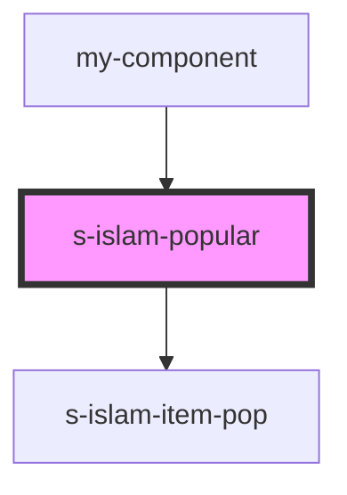

# s-islam-popular

<!-- Auto Generated Below -->

## Properties

| Property     | Attribute     | Description | Type  | Default     |
| ------------ | ------------- | ----------- | ----- | ----------- |
| `forPopular` | `for-popular` |             | `any` | `undefined` |

## Dependencies

### Used by

 - [my-component](../my-component)

### Depends on

- [s-islam-item-pop](./res/view/s-islam-item-pop)

### Graph

----------------------------------------------

*Built with [StencilJS](https://stenciljs.com/)*
