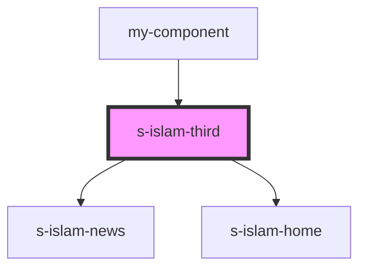

# s-islam-third

<!-- Auto Generated Below -->

## Properties

| Property   | Attribute   | Description | Type  | Default     |
| ---------- | ----------- | ----------- | ----- | ----------- |
| `forThird` | `for-third` |             | `any` | `undefined` |

## Dependencies

### Used by

 - [my-component](../my-component)

### Depends on

- [s-islam-news](./res/view/s-islam-news)
- [s-islam-home](./res/view/s-islam-home)

### Graph

----------------------------------------------

*Built with [StencilJS](https://stenciljs.com/)*
